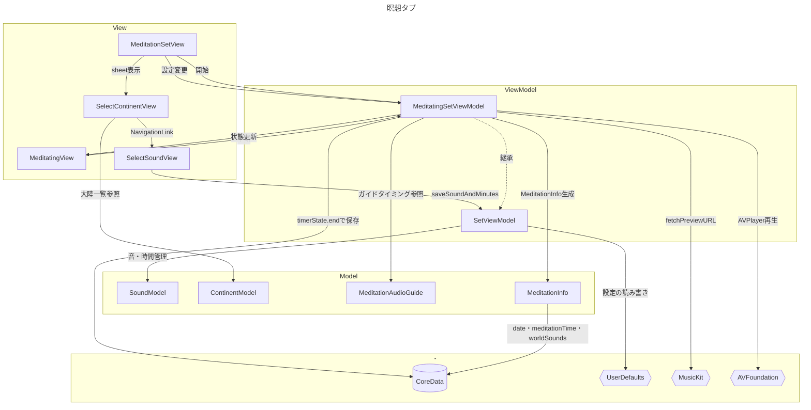
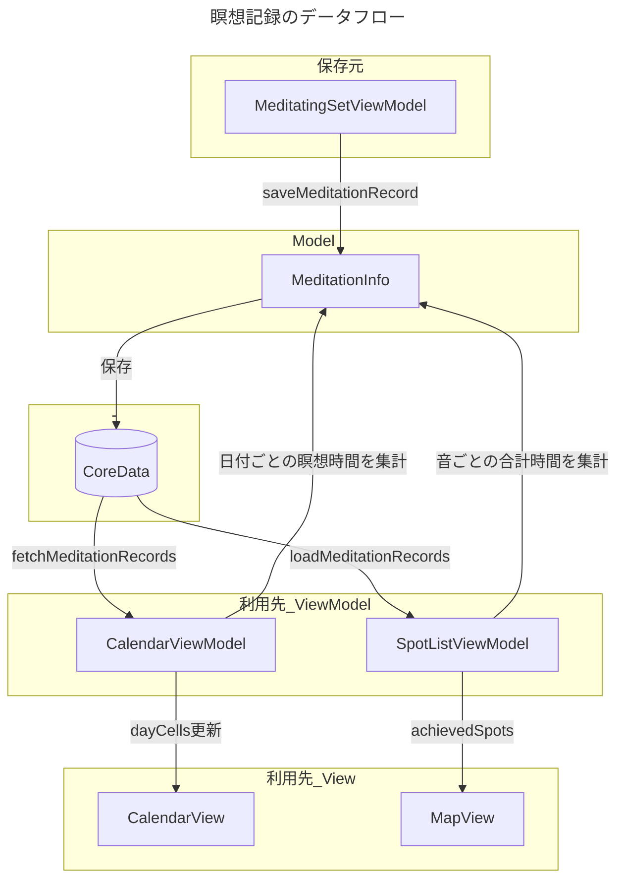

# Breath Trip 

## 1. 概要
息（呼吸瞑想）しながら世界旅行ができる iOS アプリです。 
6 大陸・36 か所の環境音（Apple Music 経由）とタイマー、瞑想記録、地図表示、日本語の音声ガイドを組み合わせて「息のたび」を楽しめます。

## 2. ダウンロードリンク

## 3. アプリのコンセプト

 
 

## 4. 実行画面

## 5. アプリの機能
### 瞑想

- 瞑想時間の選択（1 / 3 / 5 / 10 / 20 / 30 / 40 / 50 / 60 分）
- 大陸 → 国・地域（36 か所）の音源選択
- 5 秒の準備タイマー後、本番タイマーで瞑想
- 音声ガイド（ON/OFF）：呼吸・姿勢などの日本語ナレーション（`VOICEVOX:離途`）
- フェードイン / フェードアウト付きの BGM 再生
- 終了後、日付・瞑想時間・選択した「世界の音」の名前を Core Data に保存

### 音をきく

- 瞑想と同様に大陸・地域の音を選択
- タイマーのみで音を聴くモード（瞑想記録は行わない）
- Apple Music へのアクセスが必要

### カレンダー

- 月単位で瞑想記録を表示
- 日ごとの瞑想時間に応じてセルの背景色が変化（1〜20 分 / 21〜40 分 / 41 分以上）
- 前月・翌月への切り替え

### 地図

- MapKit で60分以上瞑想した世界のスポットをピン表示
- 音源名と緯度経度を対応付けて表示

### 瞑想とは

- アプリの説明
- 「瞑想のやりかた」「瞑想の効果」「アプリの説明」画面へのナビゲーション

## 6. 音源データ

6 大陸 × 各地域 6 か所 = **36 種類**の音があります。

| 大陸 | 例（一部） |
|------|------------|
| ヨーロッパ | スイス、イタリア、アイルランド、ノルウェー、スペイン、フランス |
| オセアニア | ニュージーランド、タヒチ、フィジー、オーストラリア、ソロモン諸島、バヌアツ |
| アジア | インド、チベット、日本、中国、スリランカ、タイ |
| アフリカ | マダガスカル、南アフリカ、ボツワナ、タンザニア、エチオピア、ケニア |
| 北アメリカ | アメリカ、カリブ海、カナダ、マヤ地域、メキシコ、グアテマラ |
| 南アメリカ | ブラジル、ベネズエラ、パラグアイ、コスタリカ、ホンジュラス、ニカラグア |

各音源は `SoundModel` の `fileName`（Apple Music のトラック ID）と紐づいています。

## 7. 内部設計

## 8. MVVMの構成
瞑想タブ

瞑想記録のデータフロー

上記の表はJavaScriptライブラリ Mermaidを利用して、マークダウン記法で作図しています。

[Mermaidについて詳細はこちらから確認できます。](https://mermaid-js.github.io/mermaid/#/)

## 9. 工夫したコード／設計
### 1. フェードイン・フェードアウトとタイマー管理
没入感を大事にするため、音の始まりと終わりを上品に聞こえるための設計を行いました。
瞑想アプリにおいて、音の開始・終了は「急に鳴る／急に止まる」体験をそのまま残してしまうため、セッション全体を途切れなく聴けるよう、**音量の指数カーブ制御**と**複数タイマーの役割分担**を組み合わせて実装しています。

#### 1. アーキテクチャ概要

| タイマー | 役割 |
|---|---|
| `selectedDurationMinutesTimer` | セッション残り時間のカウントダウン（0.1 秒間隔） |
| `fadeInTimer` | 再生開始時の音量フェードイン（0.1 秒刻み） |
| `fadeOutTimer` | 音量フェードアウト本体（0.1 秒刻み） |
| `fadeOutEndTimer` | プレビュー終了 5 秒前のフェードアウト開始を監視 |
| `preparationTimer` | 瞑想開始前の 5 秒カウントダウン（瞑想画面のみ） |

フェードの実行中かどうかは、`Timer.isValid` から導出する計算プロパティ（`isFadeIn` / `isFadeOut`）で判定し、**二重起動を防止**しています。

#### 2. 人間の耳に自然な音量カーブ（指数関数的フェード）

線形に音量を変えるのではなく、経過時間を 0〜1 に正規化したうえで **2 乗カーブ**を適用しています。

- **フェードイン**: `volume = pow(t, 2)` — 序盤はゆっくり、後半で立ち上がります。
- **フェードアウト**: `volume = startVolume × pow(1 - t, 2)` — 序盤は聴こえやすく、終盤で静かに消えます。

0.1 秒間隔（50 ステップ / 5 秒）で `AVPlayer.volume` を更新することで、急な音量変化を避けつつ、瞑想に集中しやすい聴感を実現しています。

また、セッション時間が 10 秒以下の場合や、すでにフェード処理が走っている場合はフェードをスキップし、短時間設定でも破綻しないようガードしています。 
フェードイン
https://github.com/CodeCandySchool/MeditationJourney_may/blob/b3595fe4e4fd0b5d19080d705e193ecc076c7187/MeditationJourney/ViewModel/MeditatingSetViewModel.swift#L351-L382
フェードアウト
https://github.com/CodeCandySchool/MeditationJourney_may/blob/b3595fe4e4fd0b5d19080d705e193ecc076c7187/MeditationJourney/ViewModel/MeditatingSetViewModel.swift#L383-L426

#### 3. タイマーとそれらに係るメソッドの設計

フェードインはセッションの始まりから徐々に音量を上げ、5秒後に最大音量になります。フェードアウトは1ターム終了の5秒前から徐々に音量を下げ、5秒後には消音としています。
セッション全体のタイマーだけでなく、1タームを管理するタイマー、フェードインとフェードアウトを管理するタイマーがそれぞれ動いています。
 
再生ボタン押下後、`updateState(.playing)` → `startPlayAndTimer` を起点に、次の処理が同時に動きます。
1. **フェードイン**  
   再生開始時に音量を徐々に上げる（`fadeIn` / `fadeInTimer`）
2. **1タームの終了監視**  
   プレビュー1回分の終了時刻を監視し、終了前にフェードアウトへ移行（`EndTime` / `fadeOut`）
3. **全体タイマー**  
   ユーザーが選んだ合計再生時間（1〜60分）をカウントダウン（`selectedDurationMinutesTimer`）
これにより、「タームごとの自然な切り替え」と「全体セッションの終了」を分離して扱えます。 

#### 工夫ポイント
- **責務の分割**  
  フェード用タイマーと、全体時間用タイマーを分け、互いに干渉しにくくしています。
- **終了タイミングの精度**  
  0.1秒間隔で残り時間を監視し、フェードアウト開始を安定させています。
- **短時間再生への対応**  
  残り時間が短い場合はフェードインを抑制するなど、エッジケースを考慮しています。
- **状態管理との連携**  
  フェードアウト完了後に `fadeOutComplete` → `updateState(.stopped)` へつなぎ、再生状態を明確にしています。

### 2. 音の競合やバックグラウンドへの対策
瞑想・音をきくの各フローで、ユーザーが選んだ Apple Music のプレビューを安定して再生し、他アプリの音との干渉、ホーム移行などによる中断、割り込みに対して挙動を揃え、意図しない再生の続行や二重再生を防ぐようにしました。

#### 1. 他アプリとの音の競合対策

Apple Music のプレビューを `AVPlayer` で再生します。
他アプリの音楽と同時再生になると体験が崩れるため、再生開始前に `AVAudioSession` を設定しています。

- **カテゴリ**: `.playback`
  - 本アプリの再生を優先し、他アプリの音声を抑える
  - 着信・緊急アラートなどシステム音は OS 側で最優先のまま
- **タイミング**: 再生フロー開始時に `configureAudioSession()` を呼び、`setActive(true)` する

これにより「他アプリの曲と本アプリのプレビューが重なる」状態を避けつつ、電話などの割り込みは通常どおり受けられます。
https://github.com/CodeCandySchool/MeditationJourney_may/blob/b3595fe4e4fd0b5d19080d705e193ecc076c7187/MeditationJourney/ViewModel/MeditatingSetViewModel.swift#L685-L701

#### 2. 割り込み・バックグラウンドとの連携

- **バックグラウンド**: `scenePhase == .background` でタイマーを `suspended` にし、再生を一時停止
- **音声割り込み**: `AVAudioSession.interruptionNotification` で開始時に一時停止（Listening は終了時に再開可能な場合のみ再開）
- **再生ライフサイクル**: 開始・中断・再開・終了を `updatePlaybackState` 経由でプレビュー再生と連動させ、二重再生や意図しない継続を防ぐ

https://github.com/CodeCandySchool/MeditationJourney_may/blob/b3595fe4e4fd0b5d19080d705e193ecc076c7187/MeditationJourney/ViewModel/MeditatingSetViewModel.swift#L153-L187
https://github.com/CodeCandySchool/MeditationJourney_may/blob/b3595fe4e4fd0b5d19080d705e193ecc076c7187/MeditationJourney/View/PlayingView/MeditatingView.swift#L82-L88

## 10.　テストアプリ
テストアプリでは、配信音楽サービスでの音源の取得及び連続再生や、タイマー処理のテストをしました。
### TrySpotifyAPI
途中SpotifyのAPIに関する仕様変更があり使えなくなりましたが、当初はSpotifyの利用も検討しました。 
[TrySpotifyAPI](https://github.com/CodeCandySchool/TrySpotifyAPI_may)
### TryAppleMusicAPI
[TryAppleMusicAPI](https://github.com/CodeCandySchool/TryAppleMusicAPI_may)
